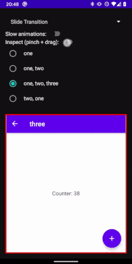
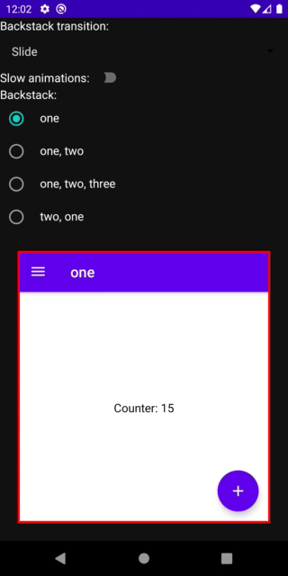
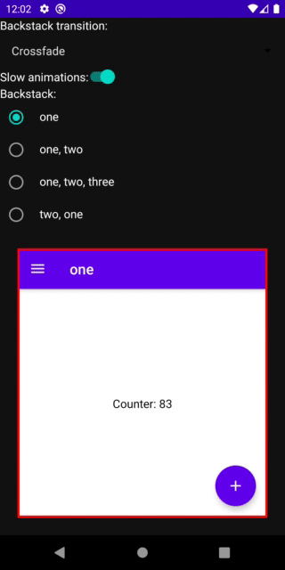
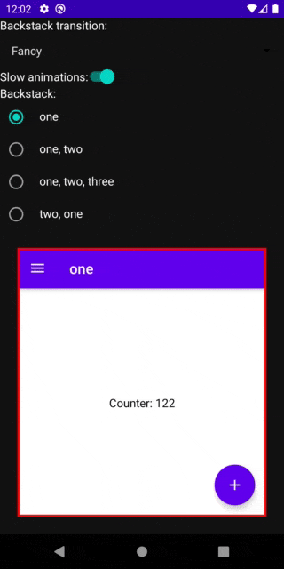

# compose-backstack
[](https://jitpack.io/#zach-klippenstein/compose-backstack)
[](https://www.apache.org/licenses/LICENSE-2.0)

Simple library for [Jetpack Compose](https://developer.android.com/jetpack/compose) for rendering
backstacks of screens and animated transitions when the stack changes. It is _not_ a navigation
library, although it is meant to be easy to plug into your navigation library of choice
(e.g. [compose-router](https://github.com/zsoltk/compose-router)), or even just use on its own.

This library is compatible with Compose dev07.

## Usage

The entry point to the library is the `Backstack` composable. It essentially looks like this:

```kotlin
@Composable fun <T : Any> Backstack(
    backstack: List<T>,
    drawScreen: @Composable() (T) -> Unit
)
```

The API is very similar to a lot of composables that draw lists: it takes a list of keys and a
composable function that knows how to draw a key. In this case, a key represents a distinct screen
in the backstack. When the top key in the stack changes between compose passes, the screens will
be animated with a transition.

The actual API takes a few more parameters, e.g. to allow custom animations. See the
[source kdoc](compose-backstack/src/main/java/com/zachklipp/compose/backstack/Backstack.kt) for
details!

## Example

```kotlin
 sealed class Screen {
   object ContactList: Screen()
   data class ContactDetails(val id: String): Screen()
   data class EditContact(val id: String): Screen()
 }

 data class Navigator(
   val push: (Screen) -> Unit,
   val pop: () -> Unit
 )

 @Composable fun App() {
   var backstack by state { listOf(Screen.ContactList) }
   val navigator = remember {
     Navigator(
       push = { backstack += it },
       pop = { backstack = backstack.dropLast(1) }
     )
   }

   Backstack(backstack) { screen ->
     when(screen) {
       Screen.ContactList -> ShowContactList(navigator)
       is Screen.ContactDetails -> ShowContact(screen.id, navigator)
       is Screen.EditContact -> ShowEditContact(screen.id, navigator)
     }
   }
 }
```

## Custom transitions

Transitions between screens are defined by implementing the `BackstackTransition` interface and
passing the implementation to the `Backstack` composable. This interface has a single method:

```kotlin
fun modifierForScreen(
    visibility: Float,
    isTop: Boolean
): Modifier
```

The `modifierForScreen` method is called for every screen in the backstack (even ones that are
completely hidden), and must return a [`Modifier`](https://developer.android.com/reference/kotlin/androidx/ui/core/Modifier)
that will be applied to the entire screen. Compose has many `Modifier`s built-in, which can be used
to do a wide variety of visual transformations such as adjust position, size, transparency, etc.

When not currently transitioning, `visibility` will be 0 for all screens except the top one, for
which `visibility` will be 1. When animating between two screens, `visibility` will be somewhere
between 0 and 1 for both the top screen and the screen immediately under the top one. The visibility
of all other screens in the stack will continue to be 0.

The `isTop` flag indicates if the returned modifier will be applied to the top screen or not, and
can be used to display a different animation for the top vs under-top screens. For example, the
`Slide` transition uses `isTop` to determine whether to translate the screen to the end/right, or
the start/left.

Visibility will always transition between 0 and 1. If you need to map that range to a different
range of floats, or any other type, you can use one of the `lerp` functions provided by Compose.

### Testing custom transitions

You can use the `BackstackViewerApp` composable in the `backstack-viewer` artifact to test your
custom transitions interactively. This composable is used by the sample app, and in the screenshots
below.

## Inspecting the backstack

The `Backstack` composable takes an optional `InspectionParams` parameter. When not null, the entire
backstack will be rendered as a translucent 3D stack. The top-most screen in the stack will still
be rendered in its regular position, but with a very low opacity, and will still be interactive. The
`BackstackInspectorParams` controls how the stack is rendered, including rotation, scaling,
opacity, etc.

You can wrap your `Backstack` with the `InspectionGestureDetector` composable to automatically
control the inspector mode using touch gestures.



## Samples

There is a sample app in the `sample` module that demonstrates various transition animations and
the behavior with different backstacks.





## Gradle

`compose-backstack` is available from Jitpack:

```
allprojects {
    repositories {
        …
        maven { url 'https://jitpack.io' }
    }
}

dependencies {
    implementation 'com.github.zach-klippenstein:compose-backstack:0.2.0'
}
```
